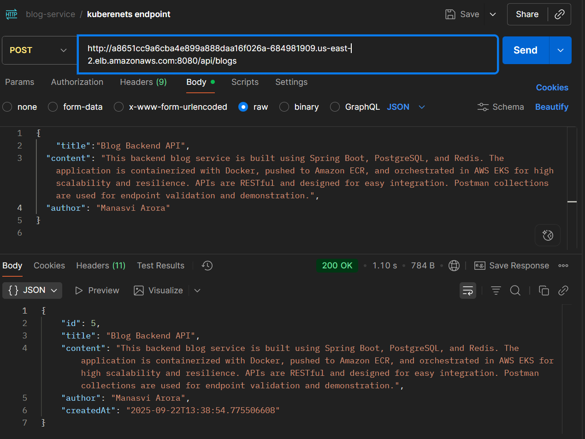
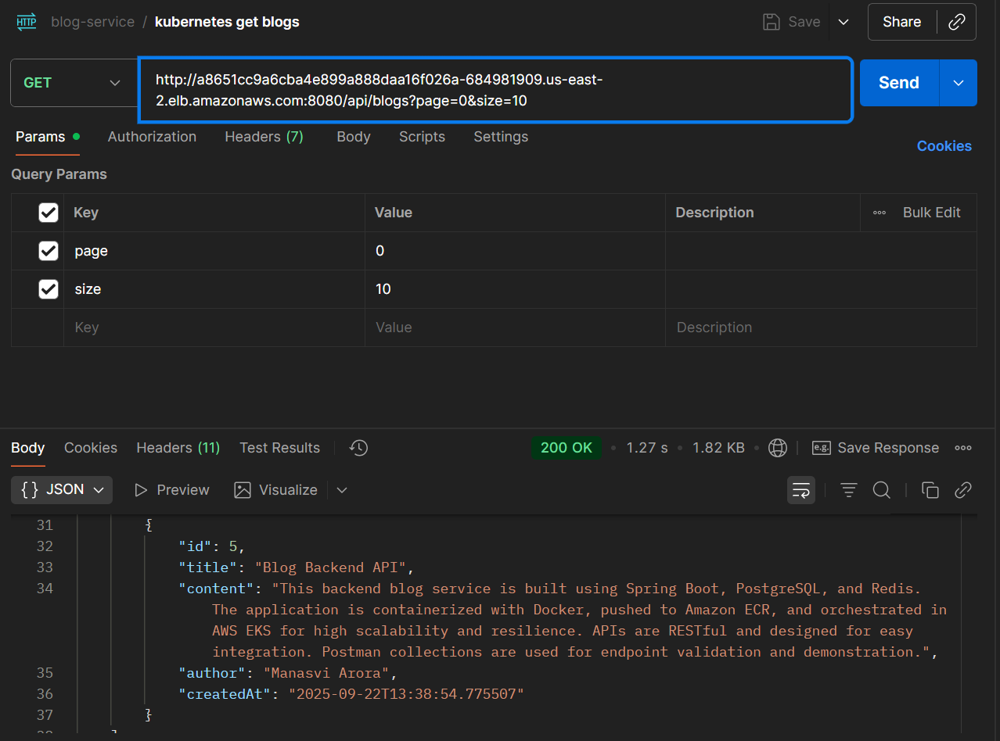
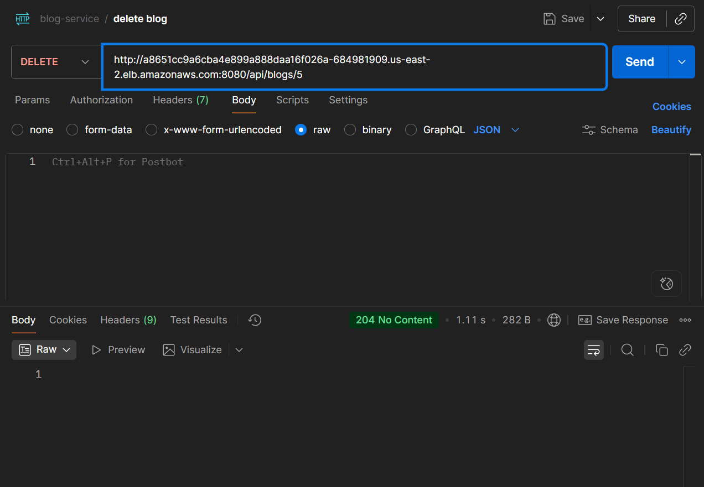
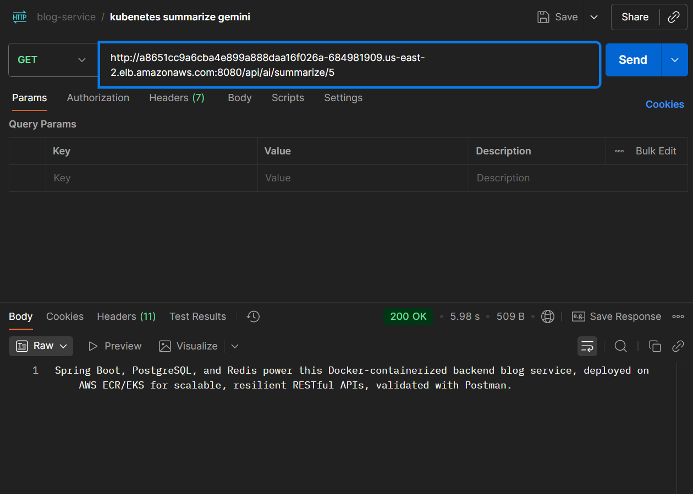
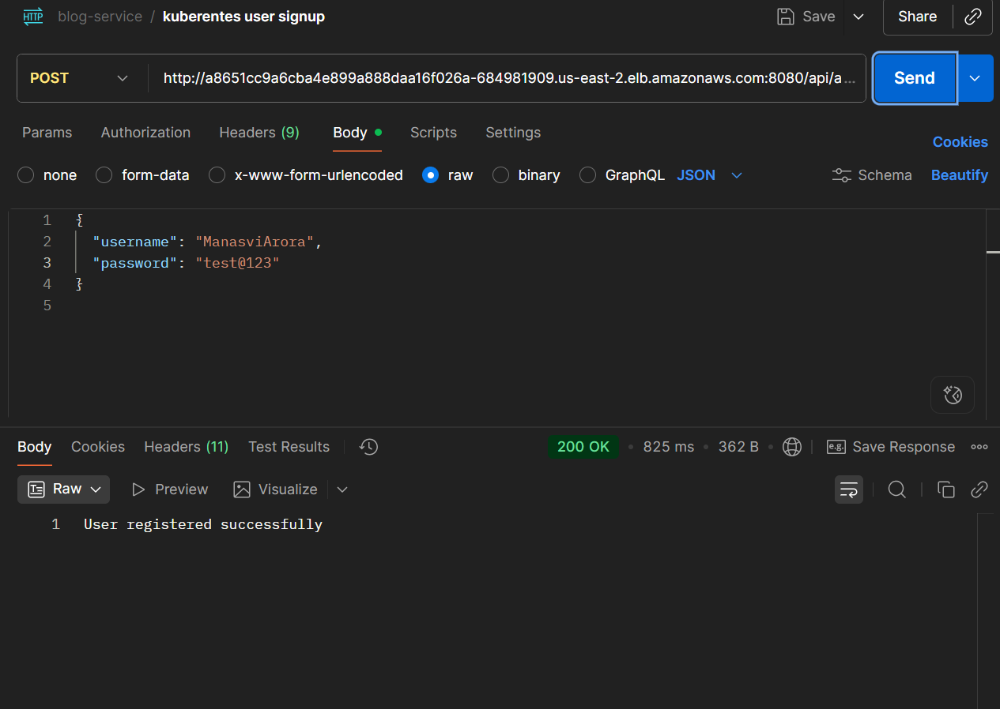
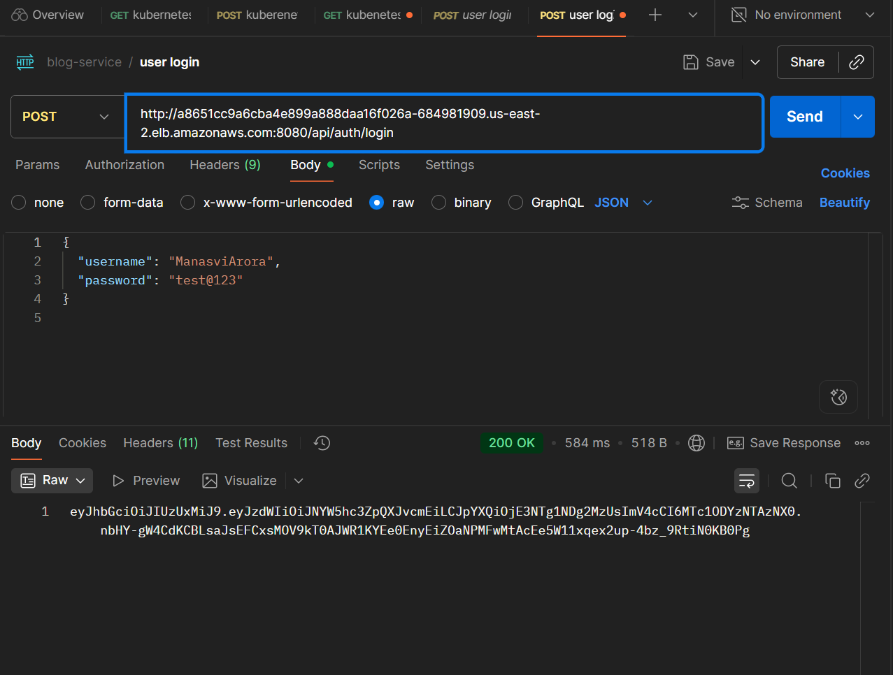

# Blog Backend API – Spring Boot + JPA + Docker + AWS + Kuberenetes (+ AI Summarization) 

## Objective
A backend service with Spring Boot and JPA for full-featured blog CRUD, pagination, JWT, Redis caching, and AI-powered summarization. Production-ready for AWS (Docker+K8s).

## Features
- Full Blog Management (CRUD)  
- Pagination for blog listing  
- AI Integration – Auto-generated summary for any blog (OpenAI, Gemini, or spaCy via REST)  
- Database: PostgreSQL/MySQL (choose in config)  
- Ready for AWS: Docker deployable, S3 support optional  
- JWT authentication, Redis caching

## API Endpoints

| Feature              | Method & Path                       | Request Body / Query                                                                                     | Description                                |
|----------------------|-------------------------------------|---------------------------------------------------------------------------------------------------------|--------------------------------------------|
| **Add blog**         | `POST /api/blogs`                   | `{ "title": "...", "content": "...", "author": "..." }`                                                 | Create a new blog                          |
| **Get all blogs**    | `GET /api/blogs?page=0&size=10`     | Query params: `page`, `size`                                                                            | List blogs (paginated)                     |
| **Get blog by ID**   | `GET /api/blogs/{id}`               | –                                                                                                       | Retrieve a specific blog by its ID         |
| **Update blog**      | `PUT /api/blogs/{id}`               | `{ "title": "...", "content": "...", "author": "...", "createdAt": "YYYY-MM-DD" }`                      | Update an existing blog                    |
| **Delete blog**      | `DELETE /api/blogs/{id}`            | –                                                                                                       | Delete a blog by its ID                    |
| **AI Summarization** | `POST /api/ai/summarize/{blogId}`   | –<br>**Response:**<br>`{ "summary": "..." }`                                                            | Get AI-generated summary for a blog        |
| **User Signup**      | `POST /api/auth/signup`             | `{ "username": "...", "email": "...", "password": "..." }`                                              | Register a new user                        |
| **User Login**       | `POST /api/auth/login`              | `{ "username": "...", "password": "..." }`                                                              | Authenticate user and get JWT token        |


## Tech Stack
- Java 17+ and Spring Boot 3+  
- Spring Data JPA  
- PostgreSQL/MySQL 
- OpenAI API OR Gemini API OR spaCy (microservice) for AI  
- Docker (deploy/optional)  
- Docker, AWS ECR, Kubernetes (EKS)
- Redis, JWT

## Quick Start

### Clone Repo
```
git clone https://github.com/manasvi-tech/blog-service.git
cd blog-service
```


### 1. Configure Database
Edit `src/main/resources/application.properties`:

```
Database (PostgreSQL by default, override for MySQL)
spring.datasource.url=jdbc:postgresql://localhost:5432/blogdb
spring.datasource.username=postgres
spring.datasource.password=

spring.jpa.hibernate.ddl-auto=update
spring.jpa.show-sql=true
spring.jpa.properties.hibernate.dialect=org.hibernate.dialect.PostgreSQLDialect

server.port=8080

Redis Cache Config
spring.cache.type=redis
spring.redis.host=localhost
spring.redis.port=6379

```

AI & AWS Keys
```
gemini.api.key=<your_gemini_api_key>
gemini.api.url=https://generativelanguage.googleapis.com/v1beta/models/gemini-2.5-flash:generateContent

cloud.aws.credentials.access-key=<your_access_key>
cloud.aws.credentials.secret-key=<your_secret_key>
cloud.aws.region.static=ap-south-1
cloud.aws.s3.bucket=your-bucket-name

```

### 2. Local Dev & Build

```
mvn clean install
mvn spring-boot:run
```

### 3. Docker Build & Local Run
```
docker build -t blog-service:latest .
docker run -p 8080:8080 blog-service:latest
```

### 4. Push Image to AWS ECR
Create ECR repo (one time, in AWS Console or CLI)
You can change the region if you want

```
aws ecr create-repository --repository-name blog-service --region us-east-2
```

Authenticate Docker to ECR
(Change the iam user, deploy-user in this case)
```
aws ecr get-login-password --region us-east-2 --profile deploy-user | docker login --username AWS --password-stdin 890742604540.dkr.ecr.us-east-2.amazonaws.com
```

Tag & Push your Image
(Replace with your own DNS)
```
docker tag blog-backend:latest 890742604540.dkr.ecr.us-east-2.amazonaws.com/blog-service:latest
docker push 890742604540.dkr.ecr.us-east-2.amazonaws.com/blog-service:latest
```

### 5. Kubernetes (EKS) Cluster Setup
(One time) Create EKS cluster:
```
eksctl create cluster --name blog-cluster --region us-east-2 --nodes 2 --node-type t3.medium --profile deploy-user
```

Ensure proper IAM permissions and clean up failed stacks before retrying.

Update kubectl config:
```
aws eks --region us-east-2 update-kubeconfig --name blog-cluster --profile deploy-user
```

Apply deployments/services:
```
kubectl get pods
kubectl get svc
```

Check Status:
```
kubectl get pods
kubectl get svc
```

### 7. Real-time Cloud API Access

Access your app using exposed LoadBalancer endpoint:

- Get your public IP:
    ```
    kubectl get svc blog-service
  ```
- Hit the API (replace <LB_ENDPOINT> with the actual external IP!):

Add a blog:     
```
curl -X POST http://<LB_ENDPOINT>:8080/api/blogs \
-H "Content-Type: application/json" \
-d '{"title": "Cloud Post", "content": "Spring Boot on AWS EKS", "author": "manasvi"}'
```
Get blogs:

```
curl http://<LB_ENDPOINT>:8080/api/blogs?page=0&size=10

```

AI Summary:
```
curl -X POST http://<LB_ENDPOINT>:8080/api/ai/summarize/1
```


Signup/Login:
```
curl -X POST http://<LB_ENDPOINT>:8080/api/auth/signup --json '{"username":"test","email":"user@mail.com","password":"mypw"}'
curl -X POST http://<LB_ENDPOINT>:8080/api/auth/login --json '{"username":"test","password":"mypw"}'
```

### Configure AI Integration
- For **OpenAI/Gemini**: Set API keys in environment variables or `application.properties`.  
- For **spaCy**: Start the Python microservice (edit endpoint in Spring config).  

### 8. Tips & Troubleshooting
-  If you change config (application.properties), always rebuild your Docker image and push a new tag.

- CrashLoopBackOff?
    - Check DB/Redis service names and env variables.
    - kubectl logs <pod> for error messages.

- Scaling:
    - Edit replicas in your deployment YAML.


# Demonstration

## Blogs

### Post Blog


### Get Blogs


### Delete Blog


### Summarize Blog


## Users

### Signup User


## Login User



## Future Scope & Planned Improvements

As the project evolves, here are some enhancements that could be implemented to make the blog-service even more robust and user-friendly:

- **CI/CD Pipeline Enhancements:**  
  Integrate automated unit and integration tests into the CI/CD workflow, along with code coverage and vulnerability scans for safer releases.

- **ElasticSearch Integration:**  
  Incorporate ElasticSearch for advanced full-text search capabilities, improving user experience when exploring blog content.

- **Social Login Functionality:**  
  Enable seamless registration and sign-in using OAuth providers like Google, GitHub, etc., allowing users to access the platform with their existing accounts.

- **Image/Media Upload:**  
  Allow users to attach images or files to blog posts, integrating AWS S3 (or similar service) for efficient media storage and retrieval.

- **Real-Time Notifications:**  
  Implement a notification system (such as WebSockets) to alert users of new comments, replies, or updates related to their posts in real time.

---

These features are planned for future releases and will address common user and contributor needs, paving the way for a more interactive and scalable platform.


## Contributing

Contributions are welcome! If you’d like to help improve this project:

1. **Fork** the repository.
2. **Clone** your fork and create a new branch:

```
git clone https://github.com/your-username/blog-service.git
cd blog-service
git checkout -b feature/your-feature-name

```

3. **Make your changes**, commit, and push:

```
git add .
git commit -m "Describe your changes"
git push origin feature/your-feature-name
```

4. **Open a Pull Request** on GitHub. Please include a clear description of what you changed and why.

**Tips:**
- Follow the existing code style.
- Make sure all tests pass before PR.
- For major changes, open an issue first to discuss.

Thank you for your contributions!


